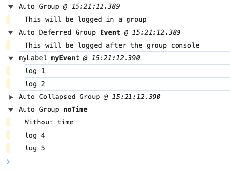

# Introduction

Tame the JS console by **automagically grouping console messages**.

 * **Simple**: Drop in replacement for the full console API.
 * **Automatic**: Groups messages by each [Event Loop](https://developer.mozilla.org/en-US/docs/Web/JavaScript/Event_loop).
 * **Easier Debugging**: Makes it much clearer to see what is going on in your app.
 * **Adds Time Stamps**: Each grouping can be timestamped, to help better see what is happening.
 * **Reliable**: Uses a [Microtask](https://developer.mozilla.org/en-US/docs/Web/API/HTML_DOM_API/Microtask_guide/In_depth) to ensure the message group is always closed on time.

A more readable console output in a couple of minutes.



_Above created by [example.ts](./example.ts)_.

## Install

Install _auto-console-group_ via npm.

```sh
npm install auto-console-group
```

## Setup

The `createAutoGroupConsole()` creates a console object with all the same methods as the regular `console` object.

```js
import createAutoGroupConsole from 'auto-console-group'

const groupConsole = createAutoGroupConsole({ options })

// All console methods are reflected on groupConsole
groupConsole.log('Log message')
groupConsole.table(['foo', 'bar'])
groupConsole.count('Counter')
```

> _If their is an uncaught error in you code, the logs leading up to the error will be displayed in a group directly after the error is logged to the console_.

## Options

The following options can be passed to `createAutoGroupConsole`.

```js
{
  label: 'label',          // First part of the group heading
  collapsed: false,        // Show group expanded or collapsed
  defaultEvent: 'event',   // Second part of the group heading, shown in bold
  showTime: true,          // Display time in the group heading
}
```

> _When the_ `collapsed` _option is set to __true__, the group will automatically open if a __warning__ or __error__ is included in the group_.

## Methods

In addition to the full [Console API](https://developer.mozilla.org/en-US/docs/Web/API/console), the following methods are also available.

### endAutoGroup()

Force the current group to output to the browser console. Any logs created after this call will appear in a new group.

### event(_string_)

Set the event type part of the group heading for just the current event loop iteration.

### purge()

Remove all messages in the current output queue.

---
_&copy; 2025 David J. Bradshaw - License MIT_
