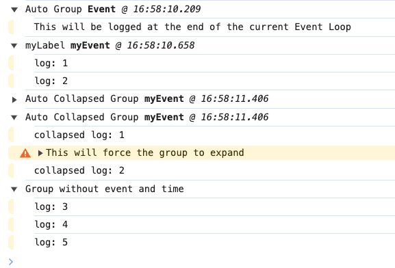

> This package has been renamed to [auto-console-group](https://www.npmjs.com/package/auto-console-group)

Tame the JS console by **automagically grouping console message**.

 * **Simple**: Drop in replacement for the full console API.
 * **Automatic**: Groups messages by each [Event Loop](https://developer.mozilla.org/en-US/docs/Web/JavaScript/Event_loop).
 * **Easier Debugging**: Makes it much clearer to see what is going on in your app.
 * **Adds Time Stamps**: Each grouping can be timestamped, to help better see what is happening.
 * **Reliable**: Uses a [Microtask](https://developer.mozilla.org/en-US/docs/Web/API/HTML_DOM_API/Microtask_guide/In_depth) to ensure the message group is always closed on time.

A more readable console output in a couple of minutes.

---
_&copy; 2025 David J. Bradshaw - License MIT_
